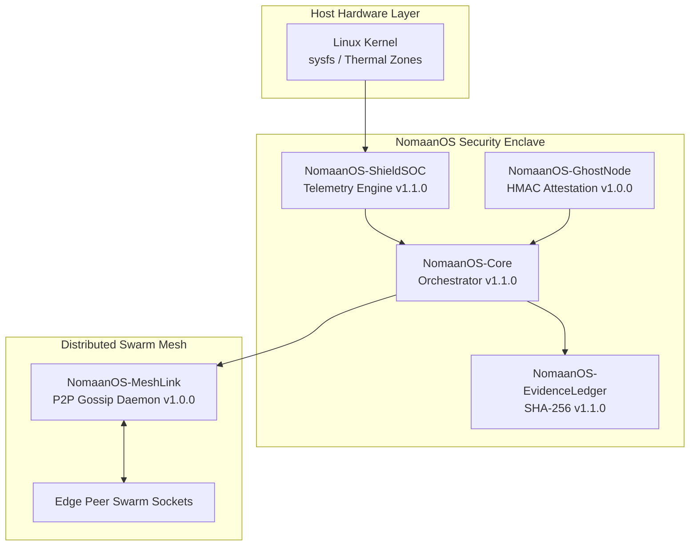

<div align="center">

# NomaanOS — Sovereign AI Stack (SAS)

### Enterprise-Hardened, Zero-Dependency Edge Security Kernel & P2P Fabric


<br>

**Architect & Principal Investigator:**  
[Nomaan Khan](https://github.com/NomaanKhan)  
Scholar @ IHFC — IIT Delhi

</div>

---

## Ecosystem Architecture Overview



## Verified Production Repositories

| Repository | Version | Status | Primary Capability |
|---|---:|---|---|
| [NomaanOS-Core](https://github.com/NomaanOS-Dev/NomaanOS-Core) | v1.1.0 | Production | Master orchestrator, CLI, TUI console, and REST daemon |
| NomaanOS-ShieldSOC | v1.1.0 | Production | Direct Linux hardware telemetry and observability engine |
| NomaanOS-EvidenceLedger | v1.1.0 | Production | Disk-persistent cryptographic hash chain |
| NomaanOS-GhostNode | v1.0.0 | Production | Keyed cryptographic enclave attestation |
| NomaanOS-MeshLink | v1.0.0 | Production | Autonomous UDP swarm discovery and dynamic topology |

## Global Verification

POSIX/Linux environment पर stack verify करने के लिए:

```bash
git clone https://github.com/NomaanOS-Dev/NomaanOS-Core.git
cd NomaanOS-Core

python3 --version
python3 nomaanos.py --status
python3 nomaanos.py chain-verify
```

अगर `python3` उपलब्ध नहीं है, तो यह command इस्तेमाल करें:

```bash
python nomaanos.py --status
python nomaanos.py chain-verify
```

## Requirements

- Python 3.8 or newer
- Linux or another POSIX-compatible environment
- No external Python dependencies required

## Troubleshooting

अगर command fail हो, तो पहले available commands देखें:

```bash
python3 nomaanos.py --help
```

Python file का syntax check करें:

```bash
python3 -m py_compile nomaanos.py
```

और repository की files verify करें:

```bash
ls -la
find . -maxdepth 2 -type f
```

## License

See the repository license for usage and distribution terms.
