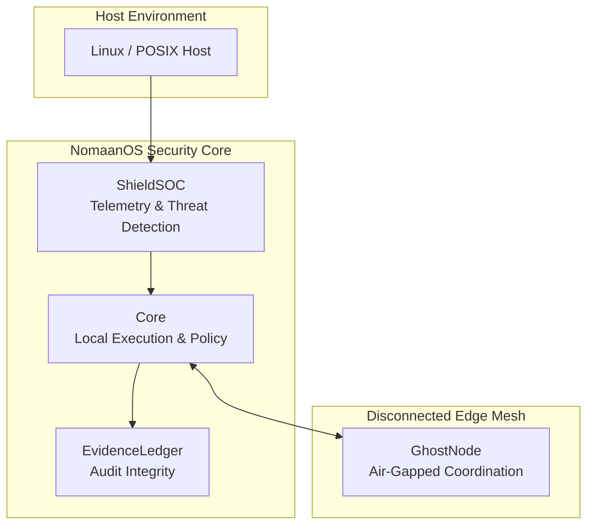

<div align="center">

# NomaanOS — Sovereign AI Stack (SAS)
### Zero-cloud, offline-first AI security research stack for edge environments

[](https://www.python.org/)
[](https://github.com/NomaanOS-Dev)
[](https://github.com/NomaanOS-Dev)
[](https://github.com/NomaanOS-Dev)

<br/>

**Architect & Principal Investigator**  
**[Nomaan Khan](https://github.com/NomaanOS-Dev)**  
*Scholar @ IHFC — IIT Delhi*

---

</div>

NomaanOS is a research-oriented sovereign edge AI stack focused on offline execution, local telemetry, tamper-evident audit logging, and air-gapped coordination. It is intended as a security-first experimental architecture for constrained and high-risk environments, not a certified production security platform.

## What this project is

This collection includes components for:

- offline AI execution and local orchestration
- host telemetry and anomaly monitoring
- cryptographic audit evidence with append-only integrity checks
- peer-to-peer coordination in disconnected environments

## Current maturity

NomaanOS is best understood as an active prototype and research project. It includes architecture documentation, working Python modules, tests, and a structured set of repositories, but it is still evolving and should be treated as experimental software unless independently validated for a specific deployment context.

## Repository map

- NomaanOS-Core — orchestration engine, CLI, API server, architecture docs
- NomaanOS-ShieldSOC — telemetry and host monitoring layer
- NomaanOS-EvidenceLedger — append-only audit store
- NomaanOS-GhostNode — air-gapped peer coordination
- NomaanOS-Production-Dashboard — operational dashboard work

## Architecture overview


```mermaid
flowchart TD
    subgraph Host["Host Environment"]
        HW["Linux / POSIX Host"]
    end

    subgraph Core["NomaanOS Security Core"]
        SOC["ShieldSOC\nTelemetry & Threat Detection"]
        CORE["Core\nLocal Execution & Policy"]
        LEDGER["EvidenceLedger\nAudit Integrity"]
    end

    subgraph Mesh["Disconnected Edge Mesh"]
        GHOST["GhostNode\nAir-Gapped Coordination"]
    end

    HW --> SOC
    SOC --> CORE
    CORE --> LEDGER
    CORE <--> GHOST
```

## Practical usage

We recommend using the project as a research and learning framework first. The codebase is structured to support experimentation and local validation, but real-world security deployment requires threat modeling, independent review, and environment-specific testing.

## Quick start

```bash
git clone https://github.com/NomaanOS-Dev/NomaanOS-Core.git
cd NomaanOS-Core
python3 -m venv .venv
source .venv/bin/activate
pip install -U pip
pip install -r requirements-dev.txt
pytest -q
python nomaanos.py --status
python nomaanos.py chain-verify
```

## Security notes

- security controls are intentionally designed to be defense-in-depth
- cryptographic checks are meaningful only when used with valid threat models and operational procedures
- treat all components as experimental until independently validated in context

## License

This project is licensed under the MIT License.

## Contact

Nomaan Khan  
[GitHub](https://github.com/NomaanOS-Dev)
