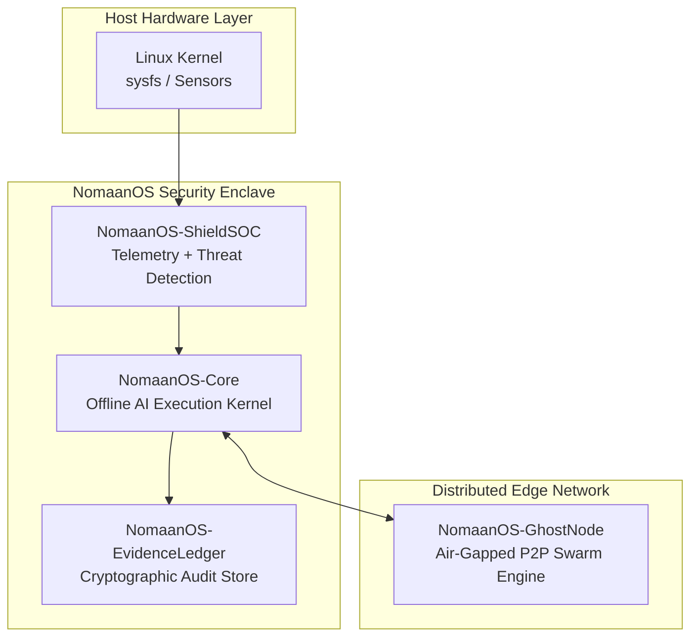

<div align="center">

# NomaanOS — Sovereign AI Stack (SAS)
### Zero-Cloud, Offline, Security-First AI Infrastructure for Edge Sovereignty

[](https://www.python.org/)
[](https://github.com/NomaanOS-Dev)
[](https://github.com/NomaanOS-Dev)
[](https://github.com/NomaanOS-Dev)

<br/>

**Architect & Principal Investigator**  
**[Nomaan Khan](https://github.com/NomaanOS-Dev)**  
*Scholar @ IHFC — IIT Delhi*

---

</div>

NomaanOS is a sovereign, privacy-preserving edge AI stack designed for environments where cloud connectivity, remote attestation, and centralized control are not acceptable. It combines local execution, cryptographic evidence, hardware telemetry, and air-gapped peer coordination into a unified operating model for resilient intelligence at the edge.

## Why NomaanOS Exists

Modern AI stacks assume cloud access, shared trust, and centralized orchestration. NomaanOS rejects that model.

- Zero-cloud by default
- Offline execution for critical workloads
- Hardware-aware telemetry and anomaly detection
- Tamper-evident evidence ledger
- Federated, peer-to-peer coordination without internet dependency
- Security-first architecture built around local trust anchors

## Ecosystem Architecture Overview


```mermaid
flowchart TD
    subgraph Host_Layer["Host Hardware Layer"]
        LK["Linux Kernel<br/>sysfs / Sensors"]
    end

    subgraph Security_Enclave["NomaanOS Security Enclave"]
        SOC["NomaanOS-ShieldSOC<br/>Telemetry + Threat Detection"]
        CORE["NomaanOS-Core<br/>Offline AI Execution Kernel"]
        LEDGER["NomaanOS-EvidenceLedger<br/>Cryptographic Audit Store"]
    end

    subgraph Mesh_Network["Distributed Edge Network"]
        GHOST["NomaanOS-GhostNode<br/>Air-Gapped P2P Swarm Engine"]
    end

    LK --> SOC
    SOC --> CORE
    CORE --> LEDGER
    CORE <--> GHOST
```

## Core Components

### NomaanOS-Core
The execution kernel for local and autonomous AI workloads. Designed to run without cloud services and to preserve operational continuity even in disconnected or adversarial environments.

### NomaanOS-ShieldSOC
A telemetry and anomaly monitoring layer that observes host activity, sensor behavior, and process-level signals to detect deviations from expected security posture.

### NomaanOS-EvidenceLedger
An append-only ledger for tamper-evident records, event traceability, and verifiable operational history. This is the trust substrate for audit and forensics.

### NomaanOS-GhostNode
A peer-to-peer swarm daemon for air-gapped distributed coordination. It enables local collaboration without internet exposure or centralized cloud control.

## Verified Production Repositories

- NomaanOS-Core — v1.1.0 — Zero-Cloud Local AI Execution Kernel
- NomaanOS-EvidenceLedger — v1.1.0 — Cryptographic, Append-Only Tamper-Proof Audit Store
- NomaanOS-ShieldSOC — v1.1.0 — Real-Time Hardware Telemetry & Threat Anomaly Detection
- NomaanOS-GhostNode — v1.0.0 — Air-Gapped Distributed Peer-to-Peer Swarm Daemon

## Quick Start

### System Requirements

- Python 3.8+
- Linux, Android (Termux), or any POSIX-compliant environment
- Standard library only: hashlib, hmac (SHA-256)

### Global Stack Verification

```bash
git clone https://github.com/NomaanOS-Dev/NomaanOS-Core.git
cd NomaanOS-Core
python3 --version
python3 nomaanos.py --status
python3 nomaanos.py chain-verify
```

If alias mapping is unavailable, run:

```bash
python nomaanos.py --status
python nomaanos.py chain-verify
```

## Security Principles

NomaanOS is built around durable trust assumptions for sovereign edge operations:

- Local-first execution, no cloud dependency
- Integrity verification through keyed cryptographic signatures
- Event provenance and tamper evidence from ledgered records
- Defensive telemetry for anomaly detection and response
- Secure interoperability among air-gapped nodes

## Diagnostics & Troubleshooting

```bash
python3 nomaanos.py --help
python3 -m py_compile nomaanos.py
ls -la
find . -maxdepth 2 -type f
```

## Roadmap

NomaanOS is positioned as a research-to-product sovereignty platform for edge AI, with emphasis on:

- hardened offline intelligence
- hardware-integrated telemetry validation
- distributed consensus-lite peer trust models
- robust evidence trails for sensitive deployments
- secure autonomous execution under disconnected conditions

## License & Intellectual Property

Licensed under the MIT License. Developed and maintained by Nomaan Khan (IHFC — IIT Delhi).
